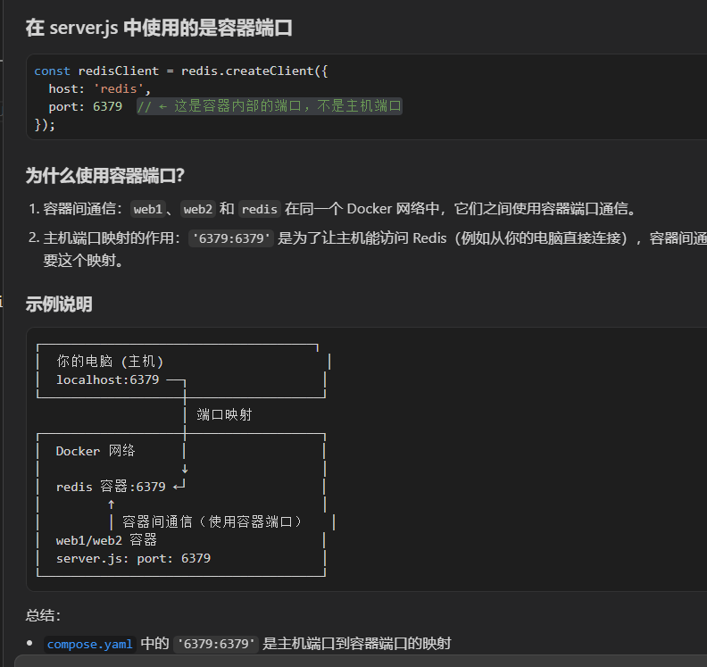
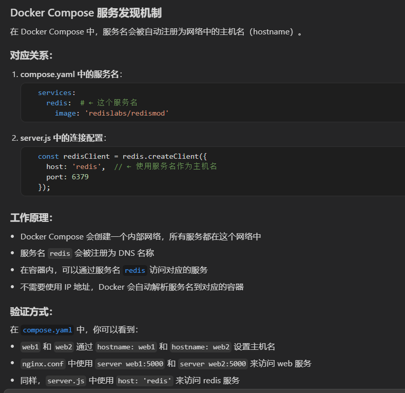

## Compose sample application

## Node.js application with Nginx proxy and Redis database

Project structure:
```
.
├── README.md
├── compose.yaml
├── nginx
│   ├── Dockerfile
│   └── nginx.conf
└── web
    ├── Dockerfile
    ├── package.json
    └── server.js

2 directories, 7 files


```
[_compose.yaml_](compose.yaml)
```
redis:
    image: 'redislabs/redismod'
    ports:
      - '6379:6379'
  web1:
    restart: on-failure
    build: ./web
    hostname: web1
    ports:
      - '81:5000'
  web2:
    restart: on-failure
    build: ./web
    hostname: web2
    ports:
      - '82:5000'
  nginx:
    build: ./nginx
    ports:
    - '80:80'
    depends_on:
    - web1
    - web2
```
The compose file defines an application with four services `redis`, `nginx`, `web1` and `web2`.
When deploying the application, docker compose maps port 80 of the nginx service container to port 80 of the host as specified in the file.


> ℹ️ **_INFO_**  
> Redis runs on port 6379 by default. Make sure port 6379 on the host is not being used by another container, otherwise the port should be changed.

## Deploy with docker compose

```
$ docker compose up -d
[+] Running 24/24
 ⠿ redis Pulled                                                                                                                                                                                                                      ...
   ⠿ 565225d89260 Pull complete                                                                                                                                                                                                      
[+] Building 2.4s (22/25)
 => [nginx-nodejs-redis_nginx internal] load build definition from Dockerfile                                                                                                                                                         ...
[+] Running 5/5
 ⠿ Network nginx-nodejs-redis_default    Created                                                                                                                                                                                      
 ⠿ Container nginx-nodejs-redis-web2-1   Started                                                                                                                                                                                      
 ⠿ Container nginx-nodejs-redis-redis-1  Started                                                                                                                                                                                      
 ⠿ Container nginx-nodejs-redis-web1-1   Started                                                                                                                                                                                      
 ⠿ Container nginx-nodejs-redis-nginx-1  Started
```


## Expected result

Listing containers must show three containers running and the port mapping as below:


```
docker-compose ps
```

## Testing the app

After the application starts, navigate to `http://localhost:80` in your web browser or run:

```
curl localhost:80
curl localhost:80
web1: Total number of visits is: 1
```

```
curl localhost:80
web1: Total number of visits is: 2
```
```
$ curl localhost:80
web2: Total number of visits is: 3
```


## Stop and remove the containers

```
$ docker compose down
```








(源码)[https://github.com/docker/awesome-compose/]

# server.js
```
server {
  listen 80;
  # 匹配的域名（核心），可写多个，用空格分隔
  server_name localhost; 
  location / {
    proxy_pass http://loadbalancer;
  }
}
```
server_name localhost; 只匹配 Host: localhost 的请求

|配置|含义|匹配请求|
|----|----|--------|
|server_name localhost;|只匹配 Host 为 localhost 的请求|http://localhost|
|server_name 192.168.1.100;|只匹配 Host 为 192.168.1.100 的请求|http://192.168.1.100|
|server_name _;|匹配所有未匹配的请求（默认 server）|所有请求|
|不设置 server_name|匹配所有请求|所有请求|
## 使用默认 server（推荐）
```
  server {
      listen 80 default_server;  # 添加 default_server
      server_name _;              # _ 是通配符，匹配所有未匹配的请求
      # 或者直接省略 server_name
  }
```

